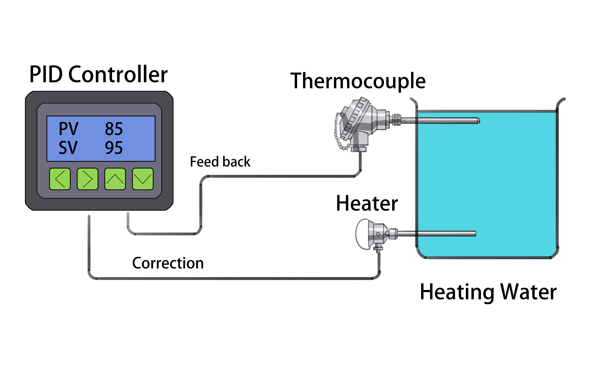

# **Session 1: Introduction to LemLib**

---

## Goals

* Get an overview of LemLib and what templates are in PROS
* Understand the benefits of LemLib

---

## What is a template?

* LemLib is considered a PROS "template"
* A template is a description of a set of files or predefined project structure that helps us set up our code for robotics tasks

---

## Why LemLib?

* Implements useful common algorithms for robotics motion such as:
  * PID
  * Pure Pursuit
  * Odometry
  * Motion Chaining

---

## Pure Pursuit

* Path following algorithm to help robot follow predefined path smoothly
* Robot looks ahead on the path and adjusts its steering to follow that point by calcuating streering angle

---

## Odometry

* Odometry is a technique used to estimate a robot's position and orientation based on its movement over time
* Uses data from wheel encoders which measure rotation
* Helps our robot navigate

---

## Motion Chaining

* Breaks down complex movements into a series of simpler movements
* Each action is performed one after another, forming a chain

---

## What is PID?

* PID Stands for Proportional, Integral, and Derivative
* Purpose: To maintain a desired output by correcting errors between the desired setpoint and the actual value

---

## Components of PID

* Proportional (P): Reacts to current error. Larger error means larger correction
* Integral (I): Reacts to the accumulated error over time
* Derivative (D): Reacts to rate of change of error

---

## PID Tuning

* Adjusting PID parameters (P, I, D) to get the desired response
* Goal: Achieve stability, fast response, and minimal error

---

## How to Tune PID: The Proportional (P) Value

* First start with increasing P which we can define as how much we want the motors to slow down as it gets to the target area, and also speed up on release.
* Example: if robot does not slow down fast enough, may want to lower P
* In the PID loop, P values will always be non-zero

## How to Tune PID: The Derivative (D) Value

* Increasing D helps to the slow down the robot as it approaches its final destination
* Example: if the robot slows down too much when trying to get to its target position, try increasing D

## How to Tune PID: The Integral (I) Value

* Increasing I helps to speed up the robot slightly faster it reaches its final destination, and helps counteracts D
* Example: if the robot slows down too much when trying to get to its target position, increasing I may help compensate it. 

---

## Tuning tips

* Adjust one constant at a time between testing
* For drives, start with tuning P, then D, and finally I

---

## PID Example: Controlling Robot's Motor Speed

* Setpoint: Desired speed
* Process Variable: Actual speed
* Error: Difference between desired and actual speed
* Use PID to adjust motor power to reach and maintain the desired speed