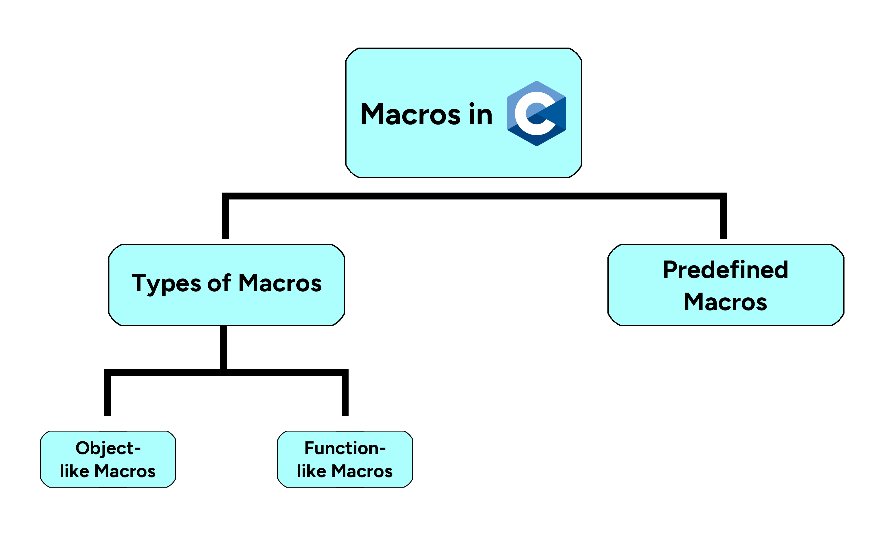

# **Session X: Macros**

---

## Goals

* Understand what macros are in C
* Learn to define and use macros and their benefits

---

## Macros in C

* Purpose: Macros are a fragment of code in C that are given a name. They are preprocessed before the compilation of the code.
* Syntax: Defined using `#define`. Example `define LEFT_MOTOR A 11`
* Macros can include functions and can be used to conditionally include code through `#ifdef`, `#ifndef`, `#endif`

## Best Practices

* Clear Naming: Use uppercase for macro names to distinguish them from variables
* Use Parentheses: Enclose macro arguments in parentheses to avoid errors
* Comments: Comment macros for clarity, as they can be confusing to interpret

## Discussion

* Why might macros be preferable to constants in some cases?
* What are the potential downsides of using function-like macros as opposed to functions?

## Demo

* Lets see how to define a simple macro and a function-like macro such as `#define SQUARE(x) ((x)*(x))

## Macros and Code Efficiency

* Macros can save memory: For example, #define SQUARE(x) ((x)*(x)) can be more memory efficient than a function call
* Macros can save time: They can be used to conditionally include debug code without the need to recompile everything

## Discussion

* How can overusing macros make code harder to maintain?
* What precautions can we take when defining macros to ensure they behave as expected?

## Macros for PROS

* Most commonly used to define constants for motor and sensor ports
* For example `#define MAX_SPEED 127`
* `motor_set_velocity(left_motor, MAX_SPEED);`

## Demo

* Let's see how we can take advantage of macros in PROS to code our VEX robot
* We will also look at PROS header files to see the common macros

## Drawbacks of Macros

* Macros are not type-checked, they are just text replacements. This can lead to more errors if not used carefully