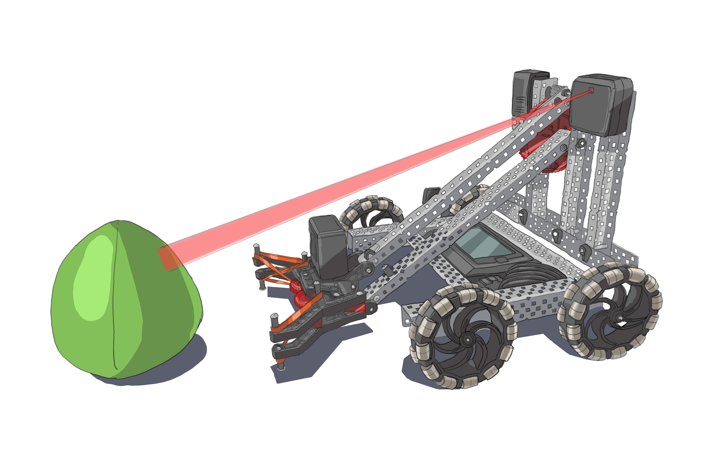

# **Session 2: PROS and C Programming Basics**

---

## Goals

* Learn the basic structure of a C program
* Learn how variables, types, and arithmetic expressions work in C

---

## Basic Structure of a C program

<!-- Notes: 

- Explanation of the main function, and its significance in a C program. We will discuss how all program execution in C starts from our main function.
- Review how to properly indent, space, and format code properly for readability and consistency.
- Give basic explanation of header, i.e. what does #include <stdio.h> mean. Header files are files with a '.h' extension and contains code that we can import into our current file. It is useful for code organization and readability.

 -->
* `main()` function: Starting point of any generic C program
* A header file is a file where you can put parts of your C code like variables, it's purpose is to make programs organized and easier to read. For example `#include <my_variables.h>`.
* Another example: `#include <stdio.h>` contains code that handles details of input and output in C

---

## Discussion

* Where does the code execution begin in a C program?
* What is a header file, and give an example of when you would use it.

---

## Demo

* Write a "Hello World" program in C by yourself. Remember the basic requirements for a generic C program.
* Create header file called `my_variables.h` with the code `int a = 5;`. Include it in our `main.c` file, and from our `main()` function print the variable a. What happens?
* Try and see what happens with and without including `<stdio.h>`. What error do you get?

---

## Variables in C: Types and Operators

<!-- Illustration: 

Show how computers execute user's PROS code:

User's PROS code -> User's PROS code compiled -> User's PROS code linked -> User's PROS code turned into executable of 1s and 0s -> Computer executes file

The source code file can be 

autonomous() {
    ....
}

-->
* Everything in a computer is just represented as 1s and 0s
* C has various operators such as +, -, *, //, /, %
* In C, we categorize data into different "types" based on the kind of information they hold. int for integer, float for decimals, char for letters, char* for words (strings), etc.
* `int`, `float`, `char`, `char*`

---

## Special Variable in C: void

* We saw for numbers we can use int or float, for letters we can use char
* Sometimes we want to specify no type, or "nothing", and we use keyword "void" to do that
* We will discuss this more next session
<!-- Note: Briefly explain that we do not declare variable type as void, but "function return type", which we will look into in more detail in a future session -->

## Discussion

<!-- Illustration:

VEX clawbot in arena with vision sensor. A green triball is in front of it, and it is receiving data as input that a programmer can then use in their program

-->

* Imagine a robot is reading vision sensor data as input, and you want to store the data into a variable. How do you think the data is represented, and what should the type be of the variable?
* What are the different uses for int, char, and float variables?
* What is the difference between the /, //, and % operators?

---

## Demo

* Let's create a C program showing different types of variable assignments and operators, as well as snippet of PROS opcontrol function that makes use of void and int variables.
* We also see how arithmetic operations are evaluated in C, difference between / and //, and common uses of % (remainder)

---

## Compiling C Programs

<!-- Notes: 

* Basic introduction to the concept of compiling - i.e. transforming C code into executable format.
* Why compiling is necessary in C, unlike some other languages such as Python. 

-->
* Compiling converts human-readable C code into machine code, allowing computers to execute it directly.
* It is a big component of what makes C code so fast

---

## Why Compile?

* Performance: Compiled code runs quickly and efficiently
* Portability: C code can be compiled for many different systems
* Other languages like Python use something called an interpreter, which translates and runs code line by line. Execution is quick, but less efficient.

---

## Demo

* Live demonstration of compiling a C program, from writing the code to execution of the compiled output.

---

## Homework

* Within main(), write code that will compute area of a triangle by declaring variables, and using appropriate arithmetic operations. Try to experiment using float and int, as well as / vs //.
* If a number is divisble by 3, print "fizz", if it is divisible by 5, print "buzz", if it is divisible by both, print "fizzbuzz"

---
