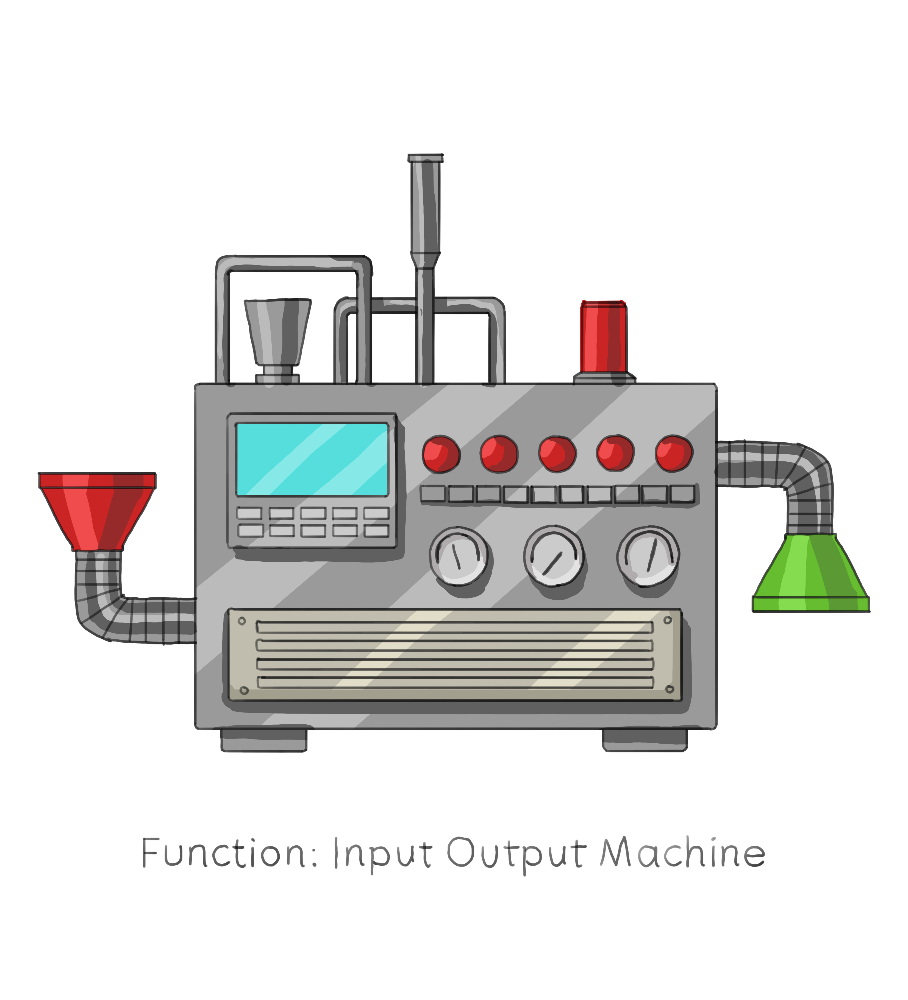

# **Session 3: Functions and Problem Solving with Programming**

---

## Goals

* Problem solving with programming
* Learn how functions and loops work in C and PROS
* How to upload your code to the VEX V5 Brain

---

## Understanding Loops

<!-- Notes: Give examples of infinite loops such as while (true) in the context of PROS opcontrol(), as well as in game development to build intuition -->
* Loops in programming such as `while` and `for` let us repeat tasks in our code. They're great for handling repetive actions.
* Any time you want to repeat some action, use a loop
* In robotics, they are commonly used in scanning and movement.

---

## Discussion

<!-- Notes: Main example discussed should be about updating state from within loop, which is most important for PROS -->
* Why are loops essential in programming, and what are their benefits?
* Give an example of a problem that would benefit from using loops.

---

## Demo

* Let's use both `while` and `for` loops to print integers from 1 to 10.
* In the PROS `opcontrol()` function, we can use a loop to have the robot move its motors. Let's see how it's done.

---

## Probem Solving with Programming

<!-- Notes: We will introduce problem solving strategies in programming such as breaking down the problem into simpler steps, designing an algorithm, and coding the solution, and how functions can be effective for this. -->
* Break problems down into simpler steps
* Design an algorithm for the solution
* Code the solution

---

## Discussion

* What are the key steps in problem solving through programming?

---

## Demo

* We will use our problem solving approach on a program that calculates the distance a robot has travelled
<!-- 
// Function to calculate the distance traveled in centimeters
// rotations: the number of wheel rotations detected by the sensor
// wheelDiameter: the diameter of the wheel in centimeters
double calculateDistance(int rotations, double wheelDiameter) {
    const double pi = 3.141592653589793;
    double wheelCircumference = pi * wheelDiameter; // Circumference = π * diameter
    double distanceTraveled = rotations * wheelCircumference;
    return distanceTraveled;
}
-->

---

## Understanding Functions

<!-- Note:
* Functions are very powerful and have broad application. Examples:
- audio effects: processing input audio data to output audio with effect (input: audio, output: audio)
- computing area of square (input number, output: number)
- image classification (input: image, output: classification)
-->
* Functions are reusable blocks of code.
* The advantages of functions: simplicity and better code organization.
* Define function name, inputs, outputs/return type
* Example: `int my_function(float x);`
* In general: `return_type name(input_type variable)`

<!-- Illustration idea: 

Functions as boxes or machines that take input and produce output. The box has no implementation details, which will highlight the usefulness of functions.

-->

---

## Function Return Types

* Functions can have return type of `int`, `float`, `char`, `char*`
* Special return type: `void`
* `void` means return type is 'nothing' or 'no type'

## Discussion

* Why are functions important in programming?
* Give an example of a function
* DRY: Don't Repeat Yourself principle

---

## Demo

* Let's see a side by side comparison of a C program with no functions used, and then the same program but with functions
* Demonstrate a simple PROS function in C that moves a motor

---

## Uploading Code to VEX V5

* Introduction to the process of uploading code to the VEX V5 using PROS
* Requirments: PROS plugin and VS Code.
* Using these tools we provide step-by-step instrucitons for how to upload sample code that will control robot's motors.

---

## Discussion

* In your own words, what are the required steps for uploading a program to the VEX V5?

---

## Demo

* Let's now see how to reverse the robots motors
