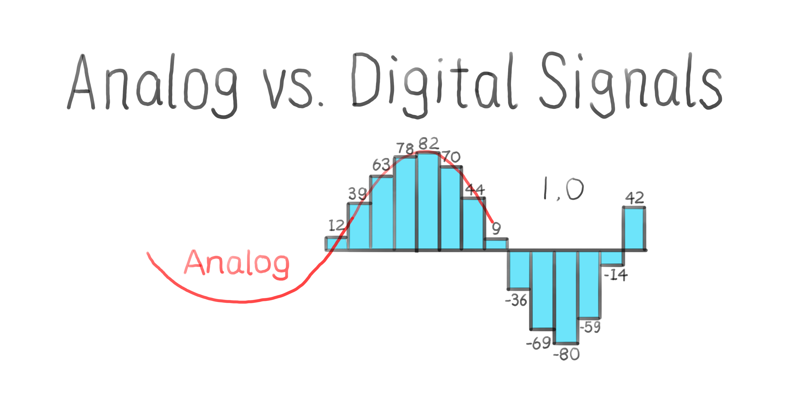

# **Session 4: Functions, Organization, and Sensors in VEX**

---

## Goals

* How header files work in C
* Analog vs Digital signals and sensors in VEX
* Understanding important PROS functions

---

## PROS Project Structure

<!-- Notes: 

Consider touring through a standard PROS project once again to remind students about its structure and briefly look inside the below files 
-->
<!-- 

Illustration: Images of file icons with small snippets of code for the three important PROS projects to better illustrate the file structure of a typical project

-->
* PROS projects are made up of three parts
  * PROS Library (/firmware)
  * Header files (/include)
  * User code (/src)

---

## PROS Header Files

<!-- Notes: Look inside api.h and main.h to get students familiar with these files -->
* api.h: contains PROS API functions such as `motor_move()`
* main.h: contains user declared code i.e. anything you want to add

---

## Main PROS Functions

<!-- 
- initialize(): Runs before the other functions. Use it to do set up such as declaring gearset (type of gears your robot uses), configuration of vision sensor (what colour should sensor detect), etc.
- opcontrol(): Main loop where your code will go to control the robot. Responsible for motor movement, sensor actions, how to respond to user controller, etc.
- autonomous(): Any code for action a robot can do without human controller goes here. Motor movement, gripping claw, etc.
-->

* `initialize()`: For setup of sensors and motors
* `opcontrol()`: To control robot motion
* `autonomous()`: For self driving

---

## Discussion

* What does `#include "api.h"` do?
* Can you explain what would happen if we did not have `#include "api.h"` in our PROS file?

---

## Demo

* Let's create a new PROS project and see how each of `initialize()`, `opcontrol()`, `autonomous()` work in practice
* We'll also define our own header file and include it in `api.h`

---

## Analog vs Digital Sensors

<!-- Notes: Explain why we need to know analog vs digital for PROS. Some sensors are analog and some are digital, and it effects how we write code and instruct computer -->

<!-- Illustration: 

Show visual difference between analog vs digital:

Show robot with analog sensor attached on the right side and an arrow to waveform data coming into the sensor
On the left side, have a digital sensor attached with an arrow to square wave/step like data of 1s and 0s coming into the sensor

note: sound wave
-->

* Sensors will read incoming signals. Signals can be either analog or digital
* Digital signals are either ON or OFF, only representing a specific set of values
  * Example: light switches
* Analog signals are continuous and vary smoothly over time  
  * Example: temperature or a volume knob. They can take on a range of values.

---

## Discussion

* Can you give examples of other analog and digital signals?

---

## Demo

* Let's see which sensors in VEX are considered analog and which are digital

---

## Important Analog Sensors in VEX

<!-- Notes: Have sensors to show students in person -->
* Potentiometer: Measures angular position.
* Light Sensor: Produces an analog value based on the amount of light it detects

---

## Important Digital Sensors in VEX

* Bumper Switch: Acts as a simple digital switch. It's either pressed (1) or not pressed (0)
* Quad Encoder: Measures rotational position of an axle and speed of rotation

---

## Discussion

* Why do you think the light sensor is considered analog, and the bumper switch is considered digital?

---

## Demo

<!-- Notes: Use light sensor and bumper switch as examples -->
* Let's connect these sensors to our V5 and read their values to see how they are represented in our code. How do you think the values will be represented?

---
