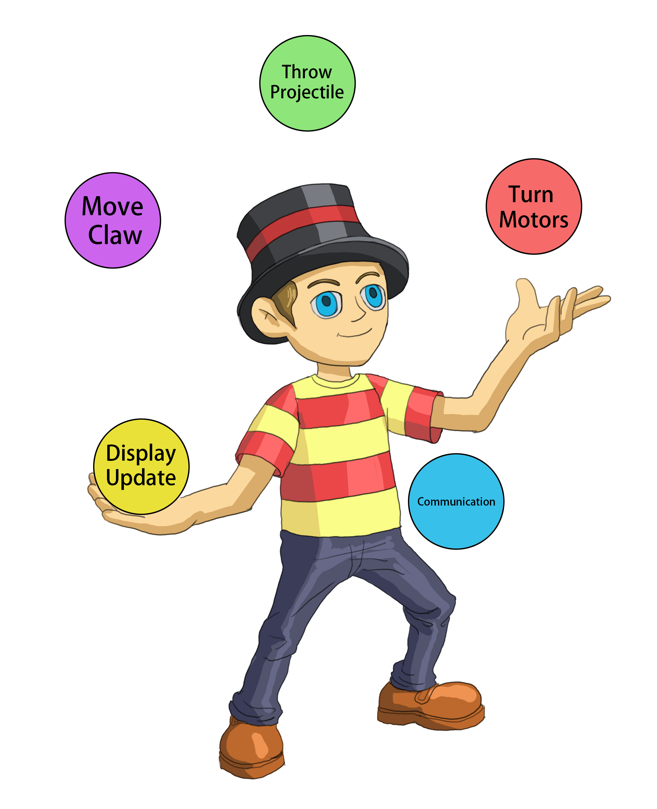

# **Session 7: Multitasking with PROS**

---

## Goals

* How to use the PROS API for multitasking
* Understand how to make your robot do multiple actions at once

---

## Overview of Multitasking

<!-- Notes: We can use it together with autonomous mode to do more complex tasks -->
<!-- This is required for to achieve many objectives for the competition -->
* They are a way to get our robot to do more things at the same time. For example, lift and turn
* Multithreading is like a kitchen where multiple chefs (threads) work on different dishes (tasks) at the same time, sharing the same kitchen space (computer resources). This makes cooking (processing) faster and more efficient.

## Discussion

* Could you think of any examples where you would need to use multitasking for VEX Robots?

## Task Scheduler

<!-- Notes: "Round robin scheduler" which controls when tasks are going to be run -->
<!-- Important to note that tasks feel like they are running at the same time because CPU is executing them so quick, not because they actually are happening at the same time-->
* Think of each task as a mini-program
* "PROS Scheduler" what controls order of task execution
* Tasks do not happen in parallel, they are swapped out very quickly one at a time by scheduler

## Creating Tasks in PROS

<!-- Notes: You have to pass in a function to the task, for example: shoot_triball() -->
<!-- Notes: Stack size lets PROS know how much data/memory your task should be able to use up -->
``task_t my_task = task_create(my_task_fn, NULL, TASK_PRIORITY_DEFAULT, TASK_STACK_DEPTH_DEFAULT, "My Task");``

* Arguments are function where the task starts, argument to the function, priority for the task, stack size and name.

## Discussion

* Can you think of any example tasks you would want to create for your robot? What arguments should we pass into ``task_create()``?

## Demo

* Let's see how to create some example tasks in PROS

## Synchronization

<!--Notes: These are known as race conditions, mutex: "mutual exclusion" -->
* If two tasks access the same data or region of memory at the same time, issues will occur. These are called "race conditions"
* We need a way to sync the tasks. One way in PROS is to use a "mutex", which allows for only one task at a time to access shared data
* ``mutex_create()``

## Example of Race Condition

<b> Scenario: Banking App Withdrawals </b>

* Transaction 1: Withdraw $100
* Transaction 2: Withdraw $200

<b> Problem: </b>

* Both transactions read balance as $1000 simultaneously.
* Transaction 1 processes, intending to update balance to $900.
* Transaction 2 processes, intending to update balance to $800.
* Final balance may incorrectly be $900 or $800 due to overwrite.
* Correct Outcome: Account balance should be $700.

<b> Reason: </b>

Lack of proper synchronization leads to incorrect account balance.

<b> Solution: </b> 

Implement synchronization mechanisms (e.g., locks, transactional memory) to ensure atomic operations and correct handling of concurrent accesses.

## Discussion

<!-- Notes: List examples related to VEX Competition -->
* What are some situations where two tasks will create issues by accessing shared data?

## Demo

* Let's see how to create a mutex for our tasks in PROS